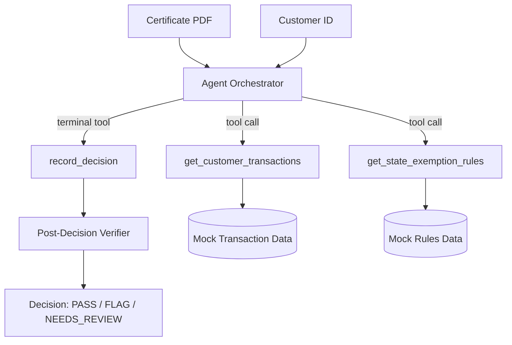

# Certificate Sentinel

A 10-hour prototype of an agentic AI system that performs **semantic validation** of sales tax exemption certificates. Built as a Principal PM interview deliverable for Vertex Inc.

> **SYNTHETIC DATA ONLY.** All customer names, taxpayer IDs, transactions, and certificates are fictional.

## What this does

Vertex's Certificate Center already validates certificates at the field level (are required fields present?). This prototype adds a **semantic layer**: an agent that reasons across the certificate content, the customer's 90-day transaction history, and applicable state exemption rules to flag mismatches that field validation misses.

Example: A restaurant chain submits a resale certificate. Fields are all present and valid. But their transactions show food consumed on premises, not resold — a semantic mismatch that field validation cannot catch.

## Demo

**Live:** `[Streamlit Cloud URL — set after deployment]`  
**Password:** Shared separately.

## Architecture



The agent uses Claude's native tool use — no LangChain, no agent framework. The loop is explicit and inspectable in the UI's "raw agent trace" expander.

## How to read this repo

```
streamlit_app.py        Entry point
src/agent/
  orchestrator.py       Agent loop (tool use, retry, hard cap)
  tools.py              Tool implementations + registry
  verifier.py           Post-decision rule citation checker
  prompts.py            System prompt
src/data/store.py       JSON data loader with typed accessors
src/eval/               Metrics and eval runner
src/ui/                 Streamlit page components
data/                   Mock JSON data (customers, transactions, rules)
eval_scenarios/         10 golden scenarios with expected outcomes
scripts/                Certificate PDF generator
docs/                   Full specification package
```

## Local setup

```bash
python -m venv .venv
.venv\Scripts\activate   # Windows
pip install -r requirements.txt
cp .env.example .env
# Edit .env: add ANTHROPIC_API_KEY and APP_PASSWORD
python scripts/generate_certificates.py
streamlit run streamlit_app.py
```

## Running tests

```bash
pytest tests/test_data.py tests/test_tools.py tests/test_eval.py -v
# End-to-end agent tests require ANTHROPIC_API_KEY and generated PDFs:
pytest tests/test_agent.py -v
```

## What this is NOT

- No real OCR — PDFs are synthetic and read natively by Claude
- No real Vertex API calls — all data is mocked JSON
- No multi-state reasoning — Texas only
- No streaming — structured decisions don't benefit from streaming
- No production observability — local JSONL logs only
- No user authentication beyond a single password gate
- No model fine-tuning

These are deliberate constraints, not gaps. The prototype demonstrates design discipline: knowing what to build and what to skip.

## Build budget

10 hours. See `docs/03_IMPLEMENTATION_GUIDE.md` for the hour-by-hour breakdown.

## Eval results

Run the eval harness from the UI's "Eval Harness" page or via:

```python
from src.eval.runner import run_eval
report = run_eval()
print(f"Precision: {report.precision:.0%}, Recall: {report.recall:.0%}")
```

Target: >= 80% precision and recall on FLAG decisions across 10 scenarios.
