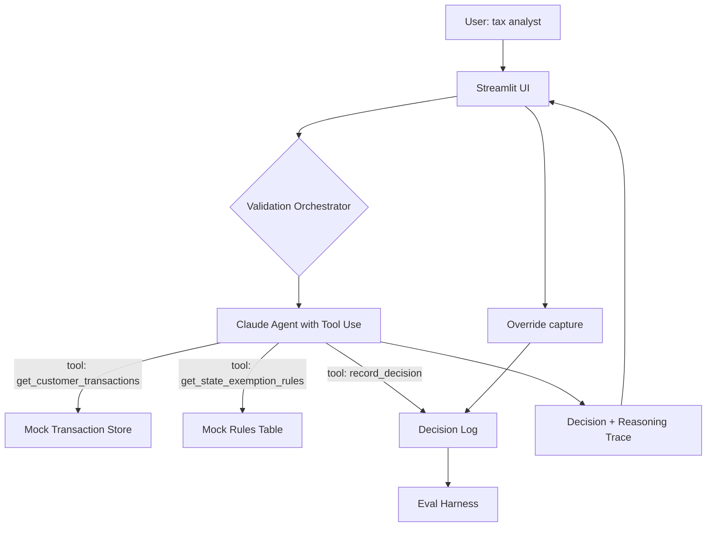

# Builder Notes: Certificate Sentinel
## Technical Design Document

**Companion to:** PRD_Certificate_Sentinel.md
**Author:** Sandesh KC
**Date:** May 2026
**Status:** Pre-build technical design
**Build budget:** 10 hours

---

## 1. What we are building (recap)

A small agentic system that, given an exemption certificate (synthetic PDF), reasons across the certificate, the customer's transaction history, and the relevant state rules, to flag semantic mismatches that field-level validation would miss. The output includes a confidence score, a structured reasoning trace, and a routing decision for human review.

The user faces a Streamlit UI. The agent is built on the Anthropic Claude API with tool use. The data is mocked. The deployment is Streamlit Cloud with a password gate.

---

## 2. Architecture overview



Five components:

1. **Streamlit UI.** Upload or select a sample certificate, view the result, override if needed.
2. **Validation Orchestrator.** A thin Python module that owns the agent loop and stitches the system together.
3. **Claude Agent with Tool Use.** The reasoning core. Receives the certificate as multimodal input, calls tools to fetch transactions and rules, produces a structured decision.
4. **Mock data stores.** JSON files for transactions, rules, customer profiles. Wrapped behind tool functions so the agent treats them as APIs.
5. **Decision Log + Eval Harness.** Every run gets logged. The eval harness replays the golden set and computes precision, recall, calibration.

The agent is the only component that uses the LLM. Everything else is deterministic Python.

---

## 3. Tech stack and rationale

| Choice | Why this | Why not the alternative |
| --- | --- | --- |
| Python 3.11 | Standard for AI prototypes, matches your existing stack | C# would be unnecessarily heavy for a prototype |
| Anthropic Claude API (Sonnet 4.6 or Opus 4.7) | Best-in-class reasoning + tool use + native PDF support | OpenAI works too; sticking with one provider keeps prompts tuned |
| Native Claude tool use (function calling) | Demonstrates real agentic pattern; minimal abstraction | LangChain/LlamaIndex add weight and obscure the design; rolling our own keeps it inspectable |
| Streamlit | Fastest path from logic to demo URL; free deployment tier | Next.js/React is overkill for a prototype, costs days of UI work |
| JSON files for mock data | No database setup, easy to inspect and modify | SQLite would be over-engineered for 10 customers and 20 rules |
| Pytest for eval | Standard, readable, gives us CI later if needed | Custom runner would just reinvent pytest |
| Streamlit Cloud | Free, GitHub-integrated, public URL, HTTPS out of the box | Vercel/Render require more setup for less benefit at this scale |

The principle: pick the simplest tool that does the job, and be ready to defend the choice. "I used native tool use instead of LangChain because I wanted the architecture to be inspectable in 50 lines, not 500" is a Principal-level answer.

---

## 4. Agent design (the core)

This section is the technical heart of the document. Read it twice.

### 4.1 The reasoning approach

The agent uses Claude's native tool use in a single conversational loop. The pattern is:

1. **Initial message:** system prompt (role + constraints) + user message containing the parsed certificate (as multimodal PDF input) and a directive to validate it semantically
2. **Tool calls:** the agent decides which tools to call based on what it needs (transactions, rules)
3. **Reasoning:** the agent integrates tool results, reasons step by step, and produces a final decision
4. **Structured output:** the final response conforms to a defined JSON schema (decision, confidence, citations, reasoning summary)

This is a ReAct-style pattern (Reason -> Act -> Observe -> Reason), implemented natively through Claude's tool use rather than via a framework. The agent does not have unbounded autonomy: it has exactly three tools, a structured output schema, and one shot at producing a decision.

This is deliberate. Principal-level agentic design is about giving the model just enough freedom to reason well, and just enough constraints that you can predict its failure modes.

### 4.2 Tool definitions

The agent has access to three tools. No more, no less.

**Tool 1: `get_customer_transactions`**
```
Input: customer_id (string)
Returns: a list of recent transactions for that customer, including
  - product category
  - product description
  - transaction amount
  - state of transaction
  - date
Purpose: lets the agent see what this customer actually buys
```

**Tool 2: `get_state_exemption_rules`**
```
Input: state (string), exemption_type (string)
Returns: a structured list of rules governing this exemption type in this state, including
  - rule_id
  - rule description
  - eligible product categories
  - eligible buyer types
  - required certificate fields
Purpose: lets the agent ground its reasoning in canonical rules, not model-internal "knowledge"
```

**Tool 3: `record_decision`**
```
Input: a structured decision object
  - decision: PASS, FLAG, NEEDS_REVIEW
  - confidence: float 0-1
  - reasoning_summary: human-readable
  - citations: list of {source, reference_id, excerpt}
Returns: a decision_id for tracking
Purpose: forces the agent to produce structured output and gives us the audit trail
```

**Why no field extraction tool?** Because Claude's native multimodal input handles the PDF directly. Adding a tool for it would add complexity without value.

**Why no override tool?** Because override is the human's job, not the agent's. The agent's job ends at the decision.

### 4.3 System prompt structure

The system prompt is the most important file in this repo. Drafting principles:

- Define role narrowly: "You are a tax compliance validation agent. Your job is to validate exemption certificates against state rules and customer transaction patterns."
- Bound behavior: "You will only cite rules from the get_state_exemption_rules tool. You will not cite rules from your training data. If a rule you need is not in the tool output, you will say so explicitly."
- Define output: include the JSON schema directly in the prompt, with one good example and one common mistake to avoid.
- Define confidence: explain how to score it. ("Reserve high confidence (>0.8) for cases where every piece of evidence aligns. Reserve low confidence (<0.4) for cases with significant ambiguity. Most real cases will be 0.5-0.8.")
- Define what FLAG means vs NEEDS_REVIEW vs PASS.

The full prompt is in Appendix A.

### 4.4 The agent loop

Pseudocode for the orchestrator:

```python
def validate_certificate(cert_pdf_bytes, customer_id):
    messages = [
        {
            "role": "user",
            "content": [
                {"type": "document", "source": {...pdf...}},
                {"type": "text", "text": f"Validate this certificate for customer {customer_id}."}
            ]
        }
    ]
    
    while True:
        response = anthropic.messages.create(
            model="claude-sonnet-4-6",
            system=SYSTEM_PROMPT,
            tools=TOOLS,
            messages=messages,
            max_tokens=4000
        )
        
        if response.stop_reason == "tool_use":
            tool_results = handle_tool_calls(response.content)
            messages.append({"role": "assistant", "content": response.content})
            messages.append({"role": "user", "content": tool_results})
            continue
        
        if response.stop_reason == "end_turn":
            decision = parse_structured_output(response.content)
            log_run(messages, decision)
            return decision
```

Hard cap: 10 tool-use rounds. If the agent has not produced a decision by then, return NEEDS_REVIEW with confidence 0 and a reason "agent loop exceeded budget." This is a safety mechanism.

### 4.5 Output schema

```json
{
  "decision": "PASS | FLAG | NEEDS_REVIEW",
  "confidence": 0.0 to 1.0,
  "reasoning_summary": "Human-readable summary in tax language",
  "citations": [
    {
      "source": "certificate_field | transaction | state_rule",
      "reference_id": "string identifier",
      "excerpt": "the specific text or field cited"
    }
  ],
  "metadata": {
    "tool_calls_made": int,
    "model": "claude-sonnet-4-6",
    "timestamp": "ISO 8601"
  }
}
```

---

## 5. Data design

All mock data lives in JSON files in `/data`.

### 5.1 Customers

Five to ten customer profiles. Each:
```json
{
  "customer_id": "CUST_001",
  "name": "Acme Office Supplies LLC",
  "industry": "Office supply retailer",
  "primary_business": "Resale of office products to commercial customers",
  "states_active": ["TX", "OK", "LA"]
}
```

Customer profiles are designed so that some are clearly aligned with their certificate claims and some are clearly mismatched. We want the eval set to have honest variety.

### 5.2 Transactions

Per customer, 30-50 transactions. Each:
```json
{
  "transaction_id": "TXN_00123",
  "customer_id": "CUST_001",
  "date": "2026-03-15",
  "state": "TX",
  "product_category": "Office supplies",
  "product_description": "Pens, paper, desk organizers",
  "amount_usd": 1240.00,
  "tax_charged": false
}
```

### 5.3 State rules

20 rules, all Texas, covering resale, manufacturing, agricultural exemptions. Each:
```json
{
  "rule_id": "TX_RESALE_001",
  "state": "TX",
  "exemption_type": "resale",
  "description": "Resale exemption applies only to tangible personal property purchased for resale in the ordinary course of business",
  "eligible_product_categories": ["all tangible personal property"],
  "eligible_buyer_types": ["registered retailer", "registered wholesaler"],
  "required_fields": ["buyer_name", "buyer_taxpayer_id", "seller_name", "description_of_property", "signature", "date"],
  "citation": "Texas Tax Code Section 151.302"
}
```

The rules are simplified and curated; they would be more nuanced in production.

### 5.4 Certificate scenarios

Ten synthetic certificate PDFs, generated programmatically with a templating tool (using Python's `reportlab` or `weasyprint` is fine, or a Word template if faster). The scenarios:

| ID | Type | Customer | Expected outcome | Reasoning |
|---|---|---|---|---|
| C_001 | Resale | Office supply retailer | PASS | Aligned: retailer claims resale, transactions are inventory purchases |
| C_002 | Manufacturing | Software consulting firm | FLAG | Mismatch: services firm claiming manufacturing exemption |
| C_003 | Agricultural | Farm equipment dealer | PASS | Aligned |
| C_004 | Resale | Restaurant chain | FLAG | Mismatch: restaurant transactions show food consumption, not resale of tangible property |
| C_005 | Manufacturing | Industrial manufacturer | PASS | Aligned: manufacturer buying raw materials |
| C_006 | Resale | Office supply retailer | NEEDS_REVIEW | Ambiguous: certificate is valid but transactions show some non-inventory items |
| C_007 | Manufacturing | Industrial manufacturer | FLAG | Field issue: signature missing |
| C_008 | Agricultural | Office supply retailer | FLAG | Mismatch: retailer claiming agricultural exemption |
| C_009 | Resale | New customer (no transactions) | NEEDS_REVIEW | Insufficient data |
| C_010 | Resale | Office supply retailer | PASS | Aligned, edge case with one ambiguous transaction |

Each scenario has a `expected_decision`, `expected_citations` (list of which sources should be cited), and `expected_reasoning_topics` (keywords or concepts that should appear in reasoning).

---

## 6. UI design

Streamlit, single page. Three sections:

**Section 1: Pick a certificate.**
- A dropdown of 10 sample scenarios with short descriptions
- A note: "Synthetic data only. Do not enter real customer data."

**Section 2: Run validation.**
- Click "Run Validation"
- A progress indicator with the step the agent is on (extracting fields, fetching transactions, fetching rules, reasoning)
- Latency shown when complete

**Section 3: Result.**
- Decision banner (green PASS, red FLAG, yellow NEEDS_REVIEW)
- Confidence score
- Reasoning summary in plain language
- Citations expandable by source type
- Override controls: accept the agent's decision, or override with reason code
- A small "View raw agent trace" expander for the technical reviewer

---

## 7. Eval harness design

The eval harness is its own page in the Streamlit app, password-gated separately. (Lavanya is more likely to look at this than at the certificate validator itself.)

### 7.1 What it does

Runs all 10 scenarios sequentially, captures decisions, computes:
- **Precision** on FLAG decisions: of certificates the agent flagged, how many should have been flagged
- **Recall** on FLAG decisions: of certificates that should have been flagged, how many did the agent catch
- **Calibration:** plot agent confidence vs correctness, compute Brier score
- **Latency distribution:** p50, p95, p99
- **Tool call distribution:** average tool calls per decision

### 7.2 What it shows

- A table: scenario_id, expected, actual, correct, confidence, latency, tool_calls
- Headline metrics at the top
- A confusion matrix (3x3 for the three decision types)
- A "drill down" expander on each scenario showing the full agent trace

### 7.3 Why this matters in the interview

Most candidates show a working prototype. Showing a working prototype with an eval harness is what separates a builder from a Principal. When Lavanya or the panel looks at the eval page, they see: "this person doesn't just ship code, they think about whether the code is working."

---

## 8. Logging and observability (prototype-grade)

Every agent run logs to `/logs/runs.jsonl`. One line per run:
```json
{
  "run_id": "uuid",
  "timestamp": "ISO 8601",
  "scenario_id": "C_001 or 'manual'",
  "input_summary": {"customer_id": "...", "cert_type": "..."},
  "decision": "PASS",
  "confidence": 0.87,
  "tool_calls": 2,
  "latency_ms": 14820,
  "model": "claude-sonnet-4-6",
  "raw_messages": [...the full conversation...]
}
```

This is enough for the prototype. In production we'd send to an observability stack (Datadog, Arize, or Galileo). The PRD calls this out.

---

## 9. Build sequence (10-hour budget)

Realistic, with buffer:

| Hour | Task |
| --- | --- |
| 1 | Repo setup, virtual env, Anthropic API key, basic project structure |
| 2 | Mock data: customer profiles, transactions, state rules (JSON files) |
| 3 | Synthetic certificate PDFs: 10 scenarios using Python templating |
| 4 | Tool implementations (Python functions wrapping the JSON files) |
| 5 | Agent orchestrator: tool use loop, system prompt, structured output |
| 6 | Streamlit UI: scenario picker, run button, result display |
| 7 | Override capture, run logging, raw trace expander |
| 8 | Eval harness: scenario runner, metrics computation, results page |
| 9 | Streamlit Cloud deployment, password gate, env vars, smoke tests |
| 10 | README, mermaid architecture diagram, Loom recording |

If something is going to slip, it will be hours 3 (synthetic data takes longer than expected) and 5 (prompt iteration). Build buffer in by skipping nice-to-haves: detailed scenario descriptions, multiple confidence calibration plots, fancy CSS. None of these matter for the interview signal.

---

## 10. Deployment plan

1. **GitHub repo** at a generic name (e.g., `certificate-validator-prototype`). Private; share by link in interview followup.
2. **Streamlit Cloud** connected to the repo. Auto-deploys on push to main.
3. **Environment variables** in Streamlit Cloud: `ANTHROPIC_API_KEY`, `APP_PASSWORD`.
4. **Password gate** in the app via `st.text_input(type="password")`. Compare to `APP_PASSWORD` env var. If wrong, show a friendly note and don't render the app.
5. **API spending limit** on the Anthropic account: $20.
6. **Pre-warming:** before each interview, hit the URL once to wake up the Streamlit app from sleep.
7. **Banner:** at the top of the app, "Prototype. Synthetic data only. Built for Principal PM interview prep."

---

## 11. What we will not build (revisited)

Re-stated here so it does not get scope-crept during build:

- No real OCR (use Claude native PDF)
- No real Vertex API integration
- No multi-state reasoning (Texas only)
- No production observability (local logs only)
- No model fine-tuning (API only)
- No fancy UI (Streamlit defaults are fine)
- No user authentication beyond the password gate
- No more than 10 eval scenarios (PRD aspires to 25; prototype delivers 10; the gap is honest signal of prototype discipline)

If during the build I feel pulled to add any of these, I stop and ask: "Is this required to defend the design in the interview?" If no, skip it.

---

## 12. Build-time risks

| Risk | Likelihood | Mitigation |
| --- | --- | --- |
| Prompt does not produce reliable structured output | Medium | Start with very explicit schema example in prompt; iterate on 3 scenarios before scaling |
| Synthetic certificates look unconvincing | Low (does not matter for signal) | Use a basic PDF library; don't over-invest |
| Streamlit Cloud deployment fails | Medium | Test deployment by hour 8, not hour 10 |
| API costs exceed budget | Low | $20 cap on Anthropic account; rate limit per session |
| Tool use loop hits the 10-call cap | Low | Will only happen if prompt is poorly designed; iterate on prompt |
| Agent hallucinates rules anyway | Medium | Add an explicit post-decision check: every cited rule_id must exist in the rules table; if not, downgrade decision to NEEDS_REVIEW |

The hallucination check (last row) is worth flagging in the interview. "Even with tool-use grounding, I added a programmatic verifier that every cited rule_id actually exists in the rules table. If the agent makes one up, the system catches it before showing the user. This is a defense-in-depth pattern." That is a Principal-level answer.

---

## Appendix A: System prompt (draft)

```
You are Certificate Sentinel, a tax compliance validation agent.

Your job is to validate sales tax exemption certificates by reasoning across three sources:
1. The certificate document itself (provided as PDF input)
2. The customer's recent transaction history (available via the get_customer_transactions tool)
3. The applicable state exemption rules (available via the get_state_exemption_rules tool)

Your output is a structured decision: PASS, FLAG, or NEEDS_REVIEW.

Constraints:
- You will only cite rules retrieved from the get_state_exemption_rules tool. You will not cite rules from your training knowledge. If a rule you need is not in the tool output, say so explicitly in your reasoning.
- You will cite specific transactions by transaction_id, not by paraphrase.
- You will produce your final answer using the record_decision tool with the structured schema below.
- You will not take any action on the customer's account. Your job ends at producing the decision.

Decision definitions:
- PASS: the certificate is field-valid AND the claimed exemption is consistent with the customer's transaction profile under the applicable state rule.
- FLAG: the certificate is field-invalid (missing required fields), OR the claimed exemption is inconsistent with the customer's transaction profile, OR the claim conflicts with a specific state rule.
- NEEDS_REVIEW: the certificate is field-valid but the data is insufficient to make a confident determination (e.g., new customer with no transactions, ambiguous product categories).

Confidence calibration:
- Reserve confidence > 0.8 for cases where every piece of evidence aligns and you can cite specific rules and transactions.
- Reserve confidence < 0.4 for cases with significant ambiguity or insufficient data.
- Most real cases should fall between 0.5 and 0.8.

Output schema (use record_decision tool):
{
  "decision": "PASS | FLAG | NEEDS_REVIEW",
  "confidence": float 0-1,
  "reasoning_summary": "2-4 sentences in plain tax-compliance language. No model jargon. No 'I think'. State what you found.",
  "citations": [
    {"source": "certificate_field | transaction | state_rule", "reference_id": "...", "excerpt": "..."}
  ]
}

Example of a good reasoning_summary:
"This certificate claims a manufacturing exemption under Texas Tax Code 151.318 (rule TX_MFG_002). The customer's transactions over the past 90 days show purchases in the 'Office supplies' category, not raw materials or production equipment as required by the rule. Recommending FLAG for tax team review."

Example of a bad reasoning_summary:
"I think this certificate might be wrong because the customer doesn't seem to be a manufacturer."

Begin your validation.
```

---

## Appendix B: Tool schemas (full)

```python
TOOLS = [
    {
        "name": "get_customer_transactions",
        "description": "Retrieve a sample of recent transactions for a given customer. Use this to understand what the customer actually buys.",
        "input_schema": {
            "type": "object",
            "properties": {
                "customer_id": {"type": "string", "description": "Unique customer identifier"},
                "limit": {"type": "integer", "description": "Max transactions to return", "default": 30}
            },
            "required": ["customer_id"]
        }
    },
    {
        "name": "get_state_exemption_rules",
        "description": "Retrieve the applicable rules for a given state and exemption type. Use this to ground your reasoning in canonical rules.",
        "input_schema": {
            "type": "object",
            "properties": {
                "state": {"type": "string", "description": "Two-letter state code"},
                "exemption_type": {"type": "string", "enum": ["resale", "manufacturing", "agricultural"]}
            },
            "required": ["state", "exemption_type"]
        }
    },
    {
        "name": "record_decision",
        "description": "Record your final validation decision. This is the terminal action of your work.",
        "input_schema": {
            "type": "object",
            "properties": {
                "decision": {"type": "string", "enum": ["PASS", "FLAG", "NEEDS_REVIEW"]},
                "confidence": {"type": "number", "minimum": 0, "maximum": 1},
                "reasoning_summary": {"type": "string"},
                "citations": {
                    "type": "array",
                    "items": {
                        "type": "object",
                        "properties": {
                            "source": {"type": "string", "enum": ["certificate_field", "transaction", "state_rule"]},
                            "reference_id": {"type": "string"},
                            "excerpt": {"type": "string"}
                        },
                        "required": ["source", "reference_id", "excerpt"]
                    }
                }
            },
            "required": ["decision", "confidence", "reasoning_summary", "citations"]
        }
    }
]
```

---

## Appendix C: Eval scenario JSON template

```json
{
  "scenario_id": "C_002",
  "description": "Software consulting firm submitting manufacturing exemption certificate",
  "certificate_pdf": "data/certificates/C_002_mfg_consulting.pdf",
  "customer_id": "CUST_002",
  "expected_decision": "FLAG",
  "expected_confidence_range": [0.7, 0.95],
  "expected_citation_sources": ["transaction", "state_rule"],
  "expected_reasoning_topics": ["manufacturing exemption", "service business", "no tangible production"],
  "rationale": "Services firm cannot claim manufacturing exemption; this is a clear semantic mismatch even though field-level validation passes."
}
```

---

## Closing note

This document is part of the deliverable. When the hiring team looks at the GitHub repo, this file is the second thing they read after the README. It signals that the prototype was designed before it was built, that tradeoffs were explicit, and that the builder thought about failure modes before celebrating success cases.

That signal is the actual product.
